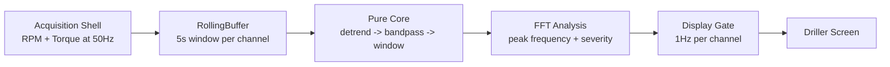

# Project Guide

This guide is for someone reading the code for the first time.

## What This Project Does

The project detects stick-slip behavior from drilling signals.

It follows a functional core / imperative shell design:

- the shell acquires samples and prints output
- the core transforms signals without mutating state

## The Data Flow

1. `sensor_stream()` emits raw `RPM` and `Torque` readings at `50Hz`
2. `RollingBuffer` stores a rolling `5s` window per channel
3. `detrend()` removes offset and drift
4. `bandpass(0.5, 8.0)` reduces unwanted frequency content
5. `windowed("hann")` prepares the signal for FFT
6. `fft_analyze()` finds the dominant frequency and severity index
7. `throttled_display(1.0)` limits screen updates to about once per second per channel

## Architecture Diagram



## File Guide

### `stickslip/types.py`

Defines the core value objects:

- `Signal`
- `FilterSpec`
- `SpectralResult`
- `DisplayUpdate`

These are the shared types used by the rest of the package.

### `stickslip/buffer.py`

Contains `RollingBuffer`, the immutable rolling window.

This is where raw samples are accumulated until the window is full.

### `stickslip/transforms.py`

Contains pure transforms:

- `detrend()`
- `bandpass()`
- `lowpass()`
- `windowed()`
- `fft_analyze()`

These functions should be easy to test because they do not perform I/O.

### `stickslip/shell.py`

Contains the effectful edges:

- `simulate_signal()`
- `simulate_channel_readers()`
- `sensor_stream()`
- `throttled_display()`
- `render_display()`

If a function talks to time, input, output, or a real sensor, it belongs here.

### `stickslip/cli.py`

Connects the shell and the pure core.

This is the best place to understand the full end-to-end execution path.

### `tests/test_core.py`

Small tests that prove the buffer and signal-processing pipeline work.

## How To Read The Code

If you want the shortest path through the project, read in this order:

1. `GUIDE.md`
2. `stickslip/types.py`
3. `stickslip/buffer.py`
4. `stickslip/transforms.py`
5. `stickslip/shell.py`
6. `stickslip/cli.py`

That matches the actual flow from acquisition to output.

## How To Run It

```bash
uv sync
uv run stickslip
```

## What To Change First

If you are extending the system, the usual starting points are:

- change the acquisition source in `shell.py`
- tune filter bands in `transforms.py`
- adjust window size in `cli.py`
- change display behavior in `shell.py`
