# Walkthrough: Dual-track detection and mitigation

## System flowchart

```mermaid
flowchart LR
  CSV["test.csv<br/>bit_rpm + torque at 0.1s intervals"] --> RPM_STREAM["csv_chunk_stream<br/>column=bit_rpm"]
  CSV --> TQ_STREAM["csv_chunk_stream<br/>column=torque"]

  subgraph THREAD1["Thread 1 — Sideband Track"]
    RPM_STREAM --> RPM_BUF["RollingBuffer<br/>5s window"]
    RPM_BUF -->|"full"| RPM_SIG["Signal"]
    RPM_SIG --> DETREND["detrend"] --> BP["bandpass 0.5–8Hz"] --> WINDOW["Hann window"] --> FFT["fft_analyze"]
    FFT --> SB["detect_sidebands"]
    SB --> HIST["ModulationHistory"]
    HIST --> ASSESS["assess"]
    ASSESS --> SS_EVENT["StickSlipEvent"]
  end

  subgraph THREAD2["Thread 2 — Energy Track"]
    TQ_STREAM --> TQ_BUF["RollingBuffer<br/>5s window"]
    TQ_BUF -->|"full"| TQ_SIG["Signal"]
    TQ_SIG --> ENERGY["compute_energy<br/>J → G(T) → K → U"]
    ENERGY --> EHIST["EnergyHistory"]
    EHIST --> EASSESS["assess"]
    EASSESS --> E_EVENT["EnergyEvent"]
  end

  SS_EVENT -->|"on_stick_slip"| CTRL["MitigationController"]
  E_EVENT -->|"on_energy"| CTRL
  CTRL --> SIG["MitigationSignal<br/>(rpm_setpoint, wob_setpoint, reason)"]
```



Two independent detection tracks run in separate threads. Each has its own buffer,
state machine, and event stream. The `MitigationController` subscribes to both
and emits setpoint adjustments.

## Setup

Pipeline defaults:
| Parameter | Value |
|---|---|
| Window | 5.0 s |
| Sample rate | 50 Hz |
| Window size | 250 samples |
| Chunk size | 10 samples |
| Channel | RPM |
| Duration | 15 s |
| Modulation frequency (fm) | ≈0.5 Hz (from drill string params) |
| Baseline RPM | 100 |
| Baseline WOB | 50 000 N |
| BHA: drill collar | OD=0.171 m, ID=0.071 m, 120 m |
| BHA: HWDP | OD=0.127 m, ID=0.076 m, 200 m |
| Drill pipe | OD=0.127 m, ID=0.108 m |
| G₀ (surface) | 79 GPa |
| Geothermal gradient | 0.03 °C/m |
| G derating | −2.3 %/100 °C |
| Off-bottom torque | 5000 Nm |

---

## Step 1 — CSV source

`test.csv` contains 1000 rows of oscillating `bit_rpm` and `torque` at 0.1 s spacing
(10 Hz raw), arranged in 5 phases:

| Phase | Rows | Behaviour |
|---|---|---|
| Normal | 1–200 | Normal drilling, low MI |
| Developing | 201–400 | MI growing, sidebands appear |
| Fully developed | 401–600 | Strong sidebands, high MI |
| Decaying | 601–800 | MI decreasing |
| Normal | 801–1000 | Back to normal |

First few rows:

| timestamp | bit_rpm | torque |
|---|---|---|
| 0.0 | 118.00 | 1800.00 |
| 0.1 | 120.79 | 1817.61 |
| 0.2 | 123.41 | 1834.95 |
| ... | ... | ... |

Each track spawns its own `csv_chunk_stream` with a different `column` parameter,
so they read independently from the same file.

---

## Step 2 — Chunk stream (sideband track)

`csv_chunk_stream(sample_rate=50.0, column="bit_rpm")` reads the CSV at the target rate:

- One call to `csv_source()` creates a reader over the `bit_rpm` column
- Every chunk reads 10 values from the reader sequentially
- Between chunks it sleeps to maintain 50 Hz × 10 samples = 0.2 s per chunk

First chunk (t ≈ 0.0 s):
```python
np.array([118.00, 120.79, 123.41, 125.71, 127.58, 128.94, 129.73, 129.90, 129.45, 128.41])
```

---

## Step 3 — Buffer accumulation (sideband track, iterations 1–25)

Each iteration pushes one chunk into the `RollingBuffer`. The buffer starts empty:

```
After chunk  1 (t=0.0s):  data = [118.00, 120.79, ... 128.41]          ( 10/250)
After chunk  2 (t=0.2s):  data = [118.00, 120.79, ... 106.29]          ( 20/250)
After chunk  3 (t=0.4s):  data = [118.00, 120.79, ... 113.32]          ( 30/250)
...
After chunk 25 (t=4.8s):  data = [118.00, 120.79, ...  last_10]        (250/250)  ✓ FULL
```

`buffer.is_full` → `True`. `buffer.to_signal()` returns a `Signal`.

The signal at this point contains the raw RPM trace over the last 5 seconds:

```python
Signal(samples=array[250 float64], sample_rate=50.0, timestamp=4.8, channel="RPM")
```

The energy track follows the same pattern with `column="torque"` and `channel="Torque"`.

---

## Steps 4–7 — Signal processing pipeline

The sideband track applies a fixed chain of pure transforms:

```
Signal → detrend → bandpass(0.5, 8.0) → hann_window → fft_analyze → SpectralResult
```

| Step | What it does |
|---|---|
| **detrend** | Removes linear drift and DC offset from the 250‑sample window |
| **bandpass** | 4th-order Butterworth `sosfiltfilt`, isolates 0.5–8.0 Hz |
| **Hann window** | Tapers edges to zero, prevents spectral leakage |
| **fft_analyze** | `rfft` → magnitude spectrum → peak frequency, severity index |

The frequency resolution is 0.2 Hz (1 / 5 s window).

---

## Step 8 — Sideband detection

`detect_sidebands(spectral, fm=0.5)` looks for peaks at `fc ± n·fm`:

```
Orders searched: n=1, n=2, n=3
Each expected frequency gets a ±0.15 Hz search window.
```

Detected sidebands: 2 (n=1 at ratio ~0.26, n=2 at ratio ~0.09)

```python
SidebandResult(
    carrier_frequency=0.4,
    modulation_frequency=0.5,
    modulation_index=0.259,       # max detected ratio
    sidebands_present=True,
    timestamp=4.8,
    channel="RPM",
    sb_orders      = [1, 2],
    sb_is_upper    = [True, True],
    sb_ratios      = [0.259, 0.094],
    ...
)
```

---

## Steps 9–10 — History and assessment (sideband)

`ModulationHistory` stores MI values and fits a linear trend with `lstsq`:

```python
growth_rate ≈ 0.015   # MI is increasing
is_growing   → True
```

`assess()` runs the decision tree:

```
1. Sidebands present?           → Yes
2. Is growing? (dMI/dt > 0.001) → Yes
3. dMI/dt ≥ 0.005?              → Yes → MITIGATE
```

---

## Step 11 — Torsional energy track

The energy track runs in parallel on a separate thread with its own buffer:

### 11a — Mean torque

Once the torque buffer is full, the window's mean surface torque is computed:

```python
mean_torque = float(np.mean(signal.samples))  # e.g. 1899.35 Nm
```

### 11b — Compute energy

`compute_energy(t_surface, bit_depth, config)` performs the full drillstring
torsional model:

**1. Build segments.** `build_segments(bit_depth, config)` reconstructs the
suspended string from fixed BHA components (drill collar, HWDP) plus drill pipe
for the remaining depth:

```
bit_depth = 1000 m
  Segment 0: drill_collar  OD=0.171 ID=0.071  L=120.0m  bottom=1000m top=880m
  Segment 1: hwdp          OD=0.127 ID=0.076  L=200.0m  bottom=880m  top=680m
  Segment 2: drill_pipe    OD=0.127 ID=0.108  L=680.0m  bottom=680m  top=0m
```

**2. Polar moment of inertia.** For each segment:

```
J = π/32 · (OD⁴ − ID⁴)

  Drill collar:  J = π/32 · (0.171⁴ − 0.071⁴) ≈ 8.21 × 10⁻⁵ m⁴
  HWDP:          J = π/32 · (0.127⁴ − 0.076⁴) ≈ 2.23 × 10⁻⁵ m⁴
  Drill pipe:    J = π/32 · (0.127⁴ − 0.108⁴) ≈ 1.22 × 10⁻⁵ m⁴
```

**3. Temperature at segment midpoint.** Geothermal gradient = 0.03 °C/m:

```
Midpoint of drill pipe:  T = 25 + 0.03 × 340  = 35.2 °C
Midpoint of HWDP:        T = 25 + 0.03 × 780  = 48.4 °C
Midpoint of drill collar: T = 25 + 0.03 × 940 = 53.2 °C
```

**4. Temperature-derated shear modulus.** G drops 2.3% per 100 °C above surface:

```
G_adjusted = G₀ · (1 − ΔT/100 · 0.023)

  Drill pipe segment:    ΔT = 10.2 → G = 79 × (1 − 0.102 × 0.023) = 78.81 GPa
  HWDP segment:          ΔT = 23.4 → G = 79 × (1 − 0.234 × 0.023) = 78.57 GPa
  Drill collar segment:  ΔT = 28.2 → G = 79 × (1 − 0.282 × 0.023) = 78.49 GPa
```

**5. Segment stiffness.** Each segment acts as a torsional spring: `k = G·J / L`

```
  Drill pipe:    k₁ = 78.81e9 × 1.22e-5 / 680  = 1414 Nm/rad
  HWDP:          k₂ = 78.57e9 × 2.23e-5 / 200  = 8760 Nm/rad
  Drill collar:  k₃ = 78.49e9 × 8.21e-5 / 120  = 53707 Nm/rad
```

**6. Series-spring compliance.** `1/K_total = 1/k₁ + 1/k₂ + 1/k₃`:

```
K_total = 1 / (1/1414 + 1/8760 + 1/53707) ≈ 1183 Nm/rad
```

**7. Bit torque.** Surface torque minus off-bottom friction:

```
T_bit = max(0, T_surface − T_off_bottom)
      = max(0, 1899 − 5000)
      = 0 Nm  (clamped — no bit torque in this scenario)
```

With the CSV torque data (~1900 Nm) below `t_off_bottom=5000`, the bit torque
clamps to zero and stored energy is 0 J. In a high-torque drilling scenario
(e.g., T_surface = 12000 Nm), the calculation would be:

```
T_bit = 12000 − 5000 = 7000 Nm
θ     = 7000 / 1183 = 5.92 rad
U     = 7000² / (2 × 1183) = 20713 J
```

### 11c — Energy history

`EnergyHistory` tracks energy values in a sliding window (default capacity = 10):

```python
history.update(result)   # append energy value, pop oldest if over capacity
history.is_warm          # True once ≥ 10 values accumulated
history.peak_energy      # max in window
history.drop_ratio       # (peak − current) / peak
history.has_sharp_drop   # drop_ratio ≥ 0.50
```

### 11d — Energy assessment

`history.assess(timestamp)` runs the energy decision tree:

```
Buffer warm?
  No  → ENERGY_NORMAL
  Yes → Sharp drop from peak (≥ 50%)?
           Yes → ENERGY_RELEASE
           No  → Recent values trending up?
                    Yes → ENERGY_BUILDING
                    No  → ENERGY_NORMAL
```

---

## Step 12 — Mitigation controller

Both detection tracks emit events to the `MitigationController`, which is wired
in `main()` as both the stick-slip and energy sink:

```python
controller = MitigationController(
    baseline_rpm=100.0, baseline_wob=50000.0,
    sink=_mitigation_sink,
)

# Each detection event also feeds the controller:
def _ss_sink(event):
    print(f"[RPM] sb={event.status} mi=...")
    controller.on_stick_slip(event)

def _energy_sink(event):
    print(f"[ENERGY] status={event.status} U=...")
    controller.on_energy(event)
```

### State tracking

The controller maintains current RPM and WOB setpoints, initialised to baseline:

```python
self._current_rpm = 100.0
self._current_wob = 50000.0
```

### Rule table

| Trigger | RPM | WOB | Reason |
|---|---|---|---|
| INTENSIFYING | 100 × 1.15 = 115 | 50000 × 0.70 = 35000 | `stick-slip intensifying (MI=0.449)` |
| MITIGATE | 100 × 1.10 = 110 | 50000 × 0.80 = 40000 | `stick-slip mitigation (MI=0.356)` |
| STABLE/MINIMAL | Ramp 5% toward 100 | Ramp 5% toward 50000 | `ramping to baseline` |
| ENERGY_RELEASE | 100 × 1.20 = 120 | 50000 × 0.50 = 25000 | `energy release detected (drop=80%)` |
| ENERGY_BUILDING | No change | 50000 × 0.85 = 42500 | `energy building — pre-emptive WOB reduction` |

### Ramping

When conditions return to normal, the controller progressively moves setpoints
back to baseline rather than jumping. Each STABLE/MINIMAL event:

```
rpm_next = current_rpm + (baseline_rpm − current_rpm) × 0.05
wob_next = current_wob + (baseline_wob − current_wob) × 0.05
```

After an INTENSIFYING event (rpm=115, wob=35000), the first STABLE event produces:

```
rpm = 115 + (100 − 115) × 0.05 = 114.25
wob = 35000 + (50000 − 35000) × 0.05 = 35750
```

The ramp repeats on each STABLE/MINIMAL event until setpoints converge to baseline.

---

## Full CLI output (representative)

```text
[ENERGY] status=ENERGY_NORMAL U=0.00J peak=0.00J drop=0.00%
[   RPM] sb=STABLE mi=0.3488 g=+0.00000/s
[   RPM] sb=MITIGATE mi=0.4487 g=+0.24971/s
[MITIGATE] rpm=110 wob=40000 — stick-slip mitigation (MI=0.449)
[ENERGY] status=ENERGY_NORMAL U=0.00J peak=0.00J drop=0.00%
[   RPM] sb=STABLE mi=0.2492 g=-0.05222/s
[MITIGATE] rpm=110 wob=40500 — ramping to baseline
[ENERGY] status=ENERGY_NORMAL U=0.00J peak=0.00J drop=0.00%
[   RPM] sb=STABLE mi=0.1270 g=-0.17673/s
[MITIGATE] rpm=109 wob=40975 — ramping to baseline
...
[   RPM] sb=MINIMAL mi=0.0000 g=+0.00000/s
[MITIGATE] rpm=100 wob=50000 — ramping to baseline
[ENERGY] status=ENERGY_NORMAL U=0.00J peak=0.00J drop=0.00%
```

The sideband track (`[RPM]`) detects stick-slip and classifies it. The mitigation
controller (`[MITIGATE]`) responds with RPM/WOB setpoint adjustments. When
conditions improve, the controller ramps back to baseline. The energy track
(`[ENERGY]`) produces `U=0.00J` because the test CSV torque (~1900 Nm) stays
below `t_off_bottom=5000` — in a real high-torque scenario, energy build-up
and release events would trigger additional mitigation signals.
