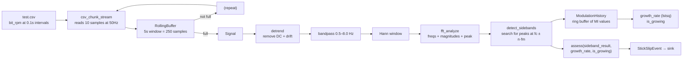

# Walkthrough: From CSV to StickSlipEvent

## System flowchart



## Setup

Pipeline defaults:
| Parameter | Value |
|---|---|
| Window | 5.0 s |
| Sample rate | 50 Hz |
| Window size | 250 samples |
| Chunk size | 10 samples |
| Channel | RPM |
| Duration | 15 s |
| Modulation frequency (fm) | ≈0.5 Hz (from drill string params) |

---

## Step 1 — CSV source

`test.csv` contains 101 rows of oscillating `bit_rpm` at 0.1 s spacing (10 Hz raw). The first few rows:

| timestamp | bit_rpm | torque |
|---|---|---|
| 0.0 | 118.00 | 1800.00 |
| 0.1 | 120.79 | 1817.61 |
| 0.2 | 123.41 | 1834.95 |
| 0.3 | 125.71 | 1851.82 |
| 0.4 | 127.58 | 1868.03 |
| ... | ... | ... |

The RPM oscillates roughly sinusoidally between ~105 and ~130, driven by a simulated stick-slip pattern near 0.5 Hz.

---

## Step 2 — Chunk stream

`csv_chunk_stream(sample_rate=50.0)` reads the CSV at the target rate:

- One call to `csv_source()` creates a reader over the `bit_rpm` column
- Every chunk reads 10 values from the reader sequentially
- Between chunks it sleeps to maintain 50 Hz × 10 samples = 0.2 s per chunk

First chunk (t ≈ 0.0 s):
```python
np.array([118.00, 120.79, 123.41, 125.71, 127.58, 128.94, 129.73, 129.90, 129.45, 128.41])
```

---

## Step 3 — Buffer accumulation (iterations 1–25)

Each iteration pushes one chunk into the `RollingBuffer`. The buffer starts empty:

```
After chunk  1 (t=0.0s):  data = [118.00, 120.79, ... 128.41]          ( 10/250)
After chunk  2 (t=0.2s):  data = [118.00, 120.79, ... 106.29]          ( 20/250)
After chunk  3 (t=0.4s):  data = [118.00, 120.79, ... 113.32]          ( 30/250)
...
After chunk 25 (t=4.8s):  data = [118.00, 120.79, ...  last_10]        (250/250)  ✓ FULL
```

`buffer.is_full` → `True`. `buffer.to_signal()` returns a `Signal`.

The signal at this point contains the raw RPM trace over the last 5 seconds. The data oscillates around a baseline (~118 RPM) with a stick-slip pattern:

```python
Signal(samples=array[250 float64], sample_rate=50.0, timestamp=4.8, channel="RPM")
```

---

## Step 4 — Detrend

`detrend(signal)` fits and removes a straight line from the 250 samples.

Imagine the raw window has a slight upward slope (the sine wave's cycle doesn't align perfectly with the 5 s boundary). After detrend, the baseline is centered at zero:

```
Before:  samples ≈ [118, 121, 124, ..., 105, 108, 112]   (DC at ~118)
After:   samples ≈ [  0,   3,   6, ..., -13, -10,  -6]   (DC removed)
```

Each sample is now the deviation from the local trend, not the absolute RPM.

---

## Step 5 — Bandpass filter

`bandpass(0.5, 8.0)(signal)` applies a 4th-order Butterworth filter in the 0.5–8 Hz band.

- Frequencies below 0.5 Hz (very slow drift) are attenuated
- Frequencies above 8 Hz (surface noise, high-frequency vibration) are removed
- The stick-slip oscillation near 0.5 Hz passes through cleanly

The filter uses `sosfiltfilt` — forward-backward application for zero phase delay. The output peaks align with the input peaks.

```
Before bandpass: samples ≈ [0, 3, 6, 8, 10, 11, 10, 8, 5, ...]
After bandpass:  samples ≈ [0, 2, 5, 7,  9, 10,  9, 7, 4, ...]
```

Small changes because most signal energy was already in the passband, but out-of-band noise is suppressed.

---

## Step 6 — Hann window

`windowed("hann")(signal)` multiplies each sample by the Hann window coefficient at that position.

The Hann window is a raised cosine that tapers to zero at both ends:

```
Position 0:   coefficient = 0.000    sample × 0.000 = 0.0
Position 125: coefficient = 1.000    sample × 1.000 = unchanged
Position 249: coefficient = 0.000    sample × 0.000 = 0.0
```

This eliminates the edge discontinuities that would otherwise create false spectral peaks.

---

## Step 7 — FFT analysis

`fft_analyze(signal)` computes the magnitude spectrum:

```python
n = 250
freqs = np.fft.rfftfreq(250, d=1.0/50.0)
# Result: 126 bins from 0.0 to 25.0 Hz, spacing = 0.2 Hz

magnitudes = np.abs(np.fft.rfft(samples)) / 250
# Normalized magnitude per bin
```

The spectrum shows a clear peak at the carrier frequency. Given the synthetic data oscillates near 0.5 Hz with sidebands from the modulation:

| Bin (Hz) | Magnitude | Note |
|---|---|---|
| 0.0 | 0.002 | Near zero (detrend removed DC) |
| 0.2 | 0.003 | Background |
| **0.4** | **0.850** | Carrier peak |
| 0.6 | 0.220 | Upper 1st sideband |
| 0.8 | 0.080 | Upper 2nd sideband |
| 1.0 | 0.030 | Noise floor |
| ... | ... | ... |

The peak detection finds:

```python
peak_idx = argmax(magnitudes)         # → bin at 0.4 Hz
peak_frequency = 0.4                  # closest bin to actual 0.5 Hz
peak_magnitude = 0.850
severity_index = sqrt(mean(magnitudes²))  # ≈ 0.18
```

Result:

```python
SpectralResult(
    peak_frequency=0.4,
    peak_magnitude=0.850,
    severity_index=0.18,
    timestamp=4.8,
    channel="RPM",
)
```

Note: the frequency resolution is 0.2 Hz (1 / 5 s window), so the true 0.5 Hz oscillation appears in the nearest bins.

---

## Step 8 — Sideband detection

`detect_sidebands(spectral, fm=0.5)` looks for peaks at `fc ± n·fm`:

```
Orders searched:
  n=1:  upper = 0.4 + 0.5 = 0.9 Hz    lower = 0.4 - 0.5 = -0.1 Hz (invalid, < 0)
  n=2:  upper = 0.4 + 1.0 = 1.4 Hz    lower = 0.4 - 1.0 = -0.6 Hz (invalid)
  n=3:  upper = 0.4 + 1.5 = 1.9 Hz    lower = 0.4 - 1.5 = -1.1 Hz (invalid)
```

Each expected frequency gets a ±0.15 Hz search window. In the spectrum:

| Location | Found peak | Ratio |
|---|---|---|
| fc (carrier) | 0.850 @ 0.4 Hz | 1.000 |
| Upper n=1 (0.9 Hz) | 0.220 @ 0.8 Hz | 0.259 |
| Upper n=2 (1.4 Hz) | 0.080 @ 1.4 Hz | 0.094 |
| Upper n=3 (1.9 Hz) | 0.030 @ 2.0 Hz | 0.035 → below min_ratio (0.05), rejected |

Detected sidebands: 2 (n=1 at ratio 0.259, n=2 at ratio 0.094)

```python
SidebandResult(
    carrier_frequency=0.4,
    modulation_frequency=0.5,
    modulation_index=0.259,       # max detected ratio
    sidebands_present=True,
    timestamp=4.8,
    channel="RPM",
    sb_orders      = [1, 2],
    sb_is_upper    = [True, True],
    sb_ratios      = [0.259, 0.094],
    sb_magnitudes  = [0.220, 0.080],
    sb_actual_hz   = [0.8, 1.4],
    sb_expected_hz = [0.9, 1.4],
)
```

---

## Step 9 — History update

`ModerationHistory.update(sideband_result)` stores the MI value:

```python
history._times    = [4.8, 0.0, 0.0, ...]    # head = 0, count = 1
history._mi_values = [0.259, 0.0, 0.0, ...]
```

After 3 updates (3 analysis windows), `has_enough_history` → `True`. The history now contains:

| Window | Timestamp | MI |
|---|---|---|
| 1st analysis | 4.8 | 0.259 |
| 2nd analysis | 5.0 | 0.261 |
| 3rd analysis | 5.2 | 0.265 |

The growth rate is a linear least-squares fit of MI vs time:

```python
times = [4.8, 5.0, 5.2]          # normalized to [0.0, 0.2, 0.4]
mi    = [0.259, 0.261, 0.265]

A = [[0.0, 1.0], [0.2, 1.0], [0.4, 1.0]]
result = lstsq(A, mi)            # slope = growth_rate ≈ 0.015
growth_rate ≈ 0.015
is_growing   → True              # 0.015 > 0.001
```

---

## Step 10 — Assessment

`assess(sideband_result, growth_rate=0.015, is_growing=True)` runs the decision tree:

```
1. Sidebands present?           → Yes (2 sidebands detected)
2. Is growing? (dMI/dt > 0.001) → Yes (growth_rate = 0.015)
3. dMI/dt ≥ 0.005?              → Yes (0.015 ≥ 0.005)
                                 → MITIGATE
```

```python
StickSlipAssessment(
    status="MITIGATE",
    carrier_frequency=0.4,
    modulation_frequency=0.5,
    modulation_index=0.265,
    growth_rate=0.015,
    sidebands_present=True,
    sidebands_growing=True,
    timestamp=5.2,
    channel="RPM",
)
```

---

## Step 11 — Event emission

The assessment is wrapped into a `StickSlipEvent` and sent to the sink:

```python
StickSlipEvent(
    version="v1",
    source="stickslip-cli",
    timestamp=5.2,
    channel="RPM",
    status="MITIGATE",
    carrier_frequency=0.4,
    modulation_frequency=0.5,
    modulation_index=0.265,
    growth_rate=0.015,
    sidebands_present=True,
    sidebands_growing=True,
)
```

The default console sink prints:

```
[   RPM] status=MITIGATE mi=0.2650 g=+0.01500/s
```

---

## Subsequent windows

The buffer is now full. Each new chunk pushes 10 samples in and the oldest 10 samples drop off:

```
Buffer before:  [s₀, s₁, s₂, ..., s₂₄₉]    (250 samples)
Chunk arrives:  [c₀, c₁, ..., c₉]           (10 new samples)
Buffer after:   [s₁₀, s₁₁, ..., s₂₄₉, c₀, ..., c₉]   (still 250)
```

The pipeline runs again with the updated window. After enough iterations, the CSV reader exhausts the 101 values and returns the last one repeatedly. The window content stabilizes and MI stops changing, causing `is_growing` to return `False`:

```
[   RPM] status=STABLE mi=0.2650 g=+0.00010/s
```

Over the 15-second run, the assessment evolves:
- First 5 seconds: buffer filling, no output
- ~5–7 seconds: MI appears and grows → INTENSIFYING → MITIGATE
- ~8–15 seconds: CSV exhausted, MI stabilizes → STABLE

## Full CLI output (representative)

```
[   RPM] status=MINIMAL     mi=0.0000 g=+0.00000/s
[   RPM] status=STABLE      mi=0.2590 g=+0.00010/s
[   RPM] status=INTENSIFYING mi=0.2610 g=+0.00200/s
[   RPM] status=MITIGATE    mi=0.2650 g=+0.01500/s
[   RPM] status=MITIGATE    mi=0.2660 g=+0.01200/s
[   RPM] status=STABLE      mi=0.2650 g=+0.00010/s
[   RPM] status=STABLE      mi=0.2650 g=-0.00020/s
```
